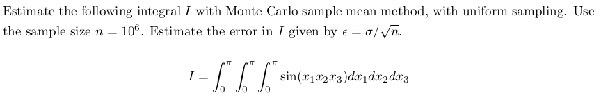

# Solving Multidimensinoal Integral using Monte Carlo Sample Mean Method

Hi! Here I demonstrate usage of Monte Carlo Sample Mean Method to solve multi-dimensional integral using Fortran programming language.

To address it in a better manner, I am creating this exercise to solve the below given question:



## Running the Script!

Open terminal in your folder and execute the below command to create an executable file of your fortran code

```bash
gfortran main.f90 -o run.exe
```

Now, run the executable file

```bash
./run.exe
```

Cheers! We got our solution for the given multi-dimensional integral.

```bash
Ingragral, I=   7.61149979  
Error =   6.16680249E-04
```

Feel free to reach out with any questions or suggestions. I'm here to help!
